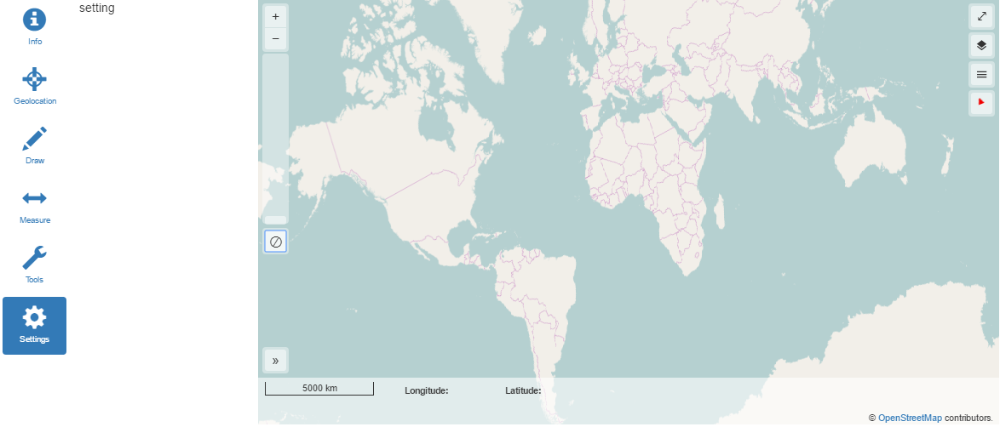

# OpenLayers helpers

[Demo](http://chrisbo246.github.io/openlayers-helpers/)

JS helpers and styles overrides for quick OL3 maps integration.



## Features

* Predefined layers, controls and inputs.
* Store / restore view and layers properties (local storage).
* Center the view on user position.
* Show / hide some controls according to map size.
* Layer settings (with layer-switcher and Bootstrap modal)
* SASS and Bootstrap 3 ready.
* Sliding panel.
* Default style improvement.
* JS helpers.
* Debug (display most Openlayers events)

## Getting Started

### Installing

Download with Bower.

```
bower install chrisbo246/openlayers-helpers
```

Insert the **openlayers-helpers.js** in your index.html

```
<script src="/bower_components/openlayers-helpers/dist/scripts/openlayers-helpers.js"></script>
```

Edit your main.scss and import the **openlayers-helpers.scss**.

```
@import "app/styles/openlayers-helpers";
```

## Development

These instructions will get you a copy of the project up and running on your local machine for development and testing purposes. See deployment for notes on how to deploy the project on a live system.

### Prerequisites

Install [Node](https://nodejs.org/en/download/) on your local machine then download dependencies.

```
npm install -g gulp-cli bower yo generator-webapp
```

### Installing

Install NPM and Bower packages.

```
npm install
bower install
```

### Testing

```
gulp serve
```

[http://localhost:9000/](http://localhost:9000/)

## Deployment

```
gulp build
```

Then upload the **dist** directory content to your web server.

<!--

## Contributing

Please read [CONTRIBUTING.md](CONTRIBUTING.md) for details on our code of conduct, and the process for submitting pull requests to us.

-->


## Bugs

Please use the [GitHub issue tracker](https://github.com/chrisbo246/openlayers-helpers/issues) for all bugs and feature requests. Before creating a new issue, do a quick search to see if the problem has been reported already.

## Author

[chrisbo246](https://github.com/chrisbo246)

See also the list of [contributors](https://github.com/chrisbo246/openlayers-helpers/contributors) who participated in this project.

## License

This project is licensed under the MIT License. See the [opensource.org](https://opensource.org/licenses/MIT) website for details.
